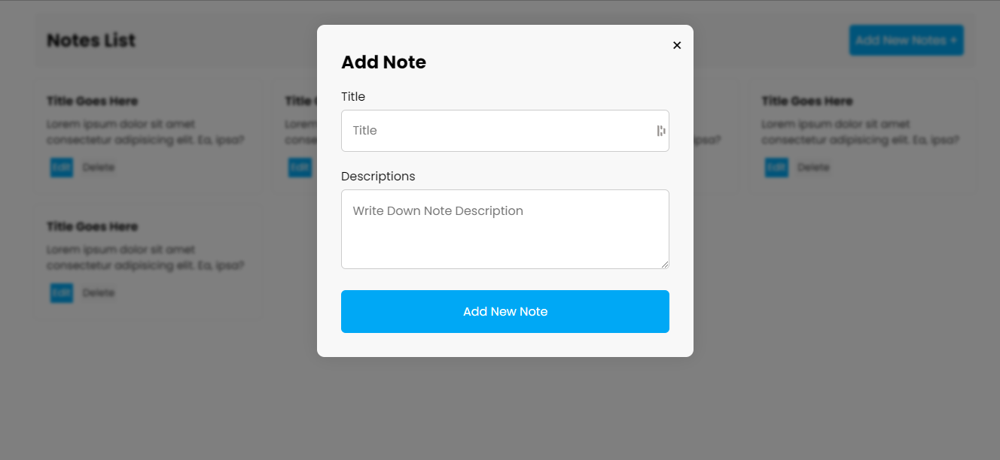

# Notes Application Using React, Redux & TypeScript

This is simple React redux application that uses TypeScript.

## Install

## Technologies

- React JS
- React Redux
- TypeScript
- Webpack
- Styled-components

## Usage

- Create your own Notes
- Read your own Notes
- Delete your own Notes
- Update your own Notes
- Search your own Notes

## Contributing

## License

## Demo Screenshot

> Thanks for reach out me on Github.
